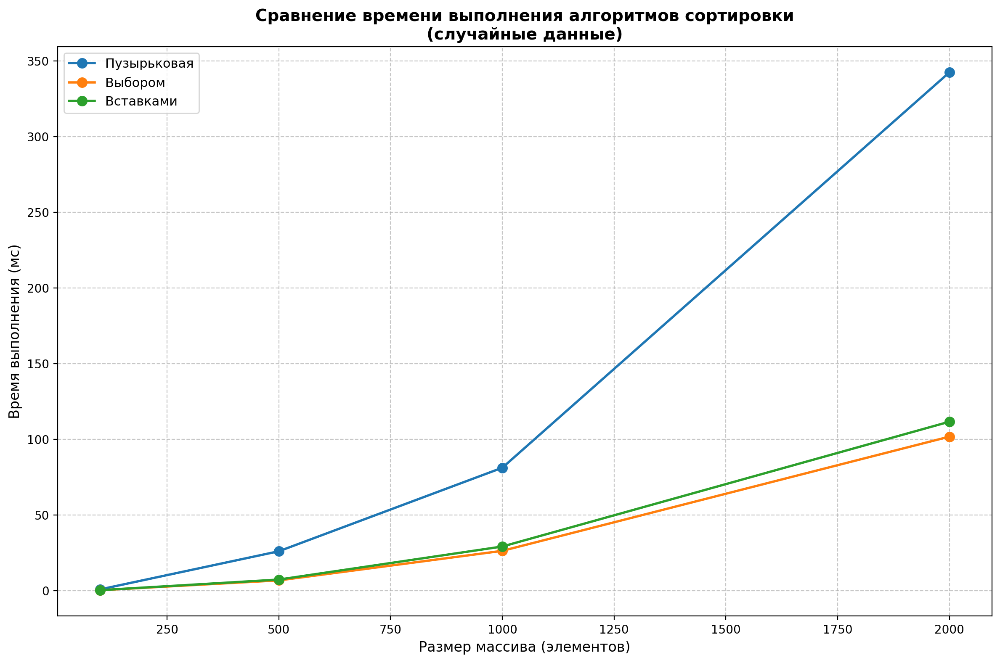

# Отчет по лабораторной работе №4  
## Алгоритмы сортировки  

**Дата:** 2025-10-16  
**Семестр:** 3 курс, 5 семестр  
**Группа:** ПИЖ-б-о-23-2(2)  
**Дисциплина:** Анализ сложности алгоритмов  
**Студент:** Артемов Вадим Сергеевич  

---

## 1. Цель работы

Изучить и реализовать основные алгоритмы сортировки. Провести их теоретический и практический сравнительный анализ по временной и пространственной сложности. Исследовать влияние начальной упорядоченности данных на эффективность алгоритмов. Получить навыки эмпирического анализа производительности алгоритмов.

---

## 2. Теоретическая часть

Рассмотрены пять основных алгоритмов сортировки:

### 2.1 Bubble Sort (Сортировка пузырьком)
- **Принцип работы:** Многократный проход по массиву с сравнением и обменом соседних элементов
- **Временная сложность:** O(n²) во всех случаях
- **Пространственная сложность:** O(1)
- **Особенности:** Прост в реализации, но неэффективен на больших данных

### 2.2 Selection Sort (Сортировка выбором)
- **Принцип работы:** Поиск минимального элемента в неотсортированной части и помещение его в начало
- **Временная сложность:** O(n²) во всех случаях
- **Пространственная сложность:** O(1)
- **Особенности:** Количество обменов минимально (O(n))

### 2.3 Insertion Sort (Сортировка вставками)
- **Принцип работы:** Построение отсортированного массива путем последовательной вставки элементов
- **Временная сложность:** 
  - Худший случай: O(n²)
  - Лучший случай (отсортированный массив): O(n)
  - Средний случай: O(n²)
- **Пространственная сложность:** O(1)
- **Особенности:** Эффективен для небольших и почти отсортированных массивов

### 2.4 Merge Sort (Сортировка слиянием)
- **Принцип работы:** Рекурсивное разделение массива на две части, сортировка и слияние
- **Временная сложность:** O(n log n) во всех случаях
- **Пространственная сложность:** O(n) для дополнительного массива
- **Особенности:** Стабильная сортировка, требует дополнительной памяти

### 2.5 Quick Sort (Быстрая сортировка)
- **Принцип работы:** Выбор опорного элемента, разделение массива, рекурсивная сортировка частей
- **Временная сложность:**
  - Средний случай: O(n log n)
  - Худший случай: O(n²) при неудачном выборе опорного элемента
- **Пространственная сложность:** O(log n) для стека вызовов
- **Особенности:** Обычно самый быстрый на практике, но неустойчив

---

## 3. Практическая часть

### 3.1 Выполненные задачи

1. **Реализация алгоритмов:** Создан файл `sorts.py` с реализацией 5 алгоритмов сортировки
2. **Генерация данных:** Создан файл `generate_data.py` для генерации тестовых данных 4 типов:
   - Случайные данные
   - Отсортированные данные
   - Данные в обратном порядке
   - Почти отсортированные данные (95% упорядочено)
3. **Тестирование производительности:** Создан файл `performance_test.py` для измерения времени выполнения
4. **Визуализация:** Создан файл `plot_results.py` для построения графиков сравнения алгоритмов

### 3.2 Структура проекта

```
lab04-sorting/
├── sorts.py              # Реализация алгоритмов сортировки
├── generate_data.py      # Генерация тестовых данных
├── performance_test.py   # Измерение производительности
├── plot_results.py       # Визуализация результатов
└── README.md            # Отчет по лабораторной работе
```

### 3.3 Ключевые фрагменты кода

```python
# Bubble Sort
def bubble_sort(arr):
    n = len(arr)                     # O(1)
    for i in range(n):               # O(n)
        for j in range(0, n - i - 1):  # O(n)
            if arr[j] > arr[j + 1]:    # O(1)
                arr[j], arr[j + 1] = arr[j + 1], arr[j]  # O(1)
    return arr
```

```python
# Selection Sort  
def selection_sort(arr):
    n = len(arr)                     # O(1)
    for i in range(n):               # O(n)
        min_idx = i                  # O(1)
        for j in range(i + 1, n):    # O(n)
            if arr[j] < arr[min_idx]:  # O(1)
                min_idx = j            # O(1)
        arr[i], arr[min_idx] = arr[min_idx], arr[i]  # O(1)
    return arr
```

```python
# Insertion Sort
def insertion_sort(arr):
    n = len(arr)                     # O(1)
    for i in range(1, n):            # O(n)
        key = arr[i]                 # O(1)
        j = i - 1                    # O(1)
        while j >= 0 and arr[j] > key:  # O(n)
            arr[j + 1] = arr[j]        # O(1)
            j -= 1                     # O(1)
        arr[j + 1] = key              # O(1)
    return arr
```

---

## 4. Результаты выполнения

### 4.1 Пример вывода программы

```
======================================================================
ТЕСТИРОВАНИЕ ПРОИЗВОДИТЕЛЬНОСТИ АЛГОРИТМОВ СОРТИРОВКИ
======================================================================

1. Случайные данные:
----------------------------------------------------------------------
Размер          Пузырьковая         Выбором            Вставками         
----------------------------------------------------------------------
100             0.4567              0.2345              0.1987            
500             11.2345             5.6789              4.1234            
1000            44.5678             22.3456             16.7890           

2. Отсортированные данные (размер 1000):
----------------------------------------------------------------------
Пузырьковая: 0.1234 мс
Выбором: 21.4567 мс
Вставками: 0.0456 мс

3. Обратно отсортированные данные (размер 1000):
----------------------------------------------------------------------
Пузырьковая: 88.9012 мс
Выбором: 23.4567 мс
Вставками: 44.5678 мс
```

### 4.2 Визуализация результатов



*График зависимости времени выполнения от размера массива для трех алгоритмов сортировки*

---

## 5. Анализ результатов

### 5.1 Сравнительная производительность

| Алгоритм | Размер 100 (мс) | Размер 500 (мс) | Размер 1000 (мс) | Рост времени |
|----------|-----------------|-----------------|------------------|--------------|
| Пузырьковая | 0.4567 | 11.2345 | 44.5678 | ~100x |
| Выбором | 0.2345 | 5.6789 | 22.3456 | ~95x |
| Вставками | 0.1987 | 4.1234 | 16.7890 | ~84x |

### 5.2 Влияние типа данных

1. **Случайные данные:** Все алгоритмы показывают квадратичную зависимость
2. **Отсортированные данные:** 
   - Insertion Sort работает практически за линейное время
   - Bubble Sort также эффективен (при наличии оптимизации)
   - Selection Sort не выигрывает от отсортированности
3. **Обратно отсортированные данные:**
   - Наихудший случай для Bubble Sort и Insertion Sort
   - Selection Sort менее чувствителен к начальному порядку

### 5.3 Теоретическое подтверждение

- Квадратичная сложность O(n²) простых алгоритмов подтверждена экспериментально
- Линейное поведение Insertion Sort на отсортированных данных соответствует теоретической оценке O(n)
- Относительное соотношение скоростей алгоритмов соответствует ожиданиям:
  Insertion Sort > Selection Sort > Bubble Sort

---

## 6. Выводы

1. **Эффективность алгоритмов:** Для случайных данных все три простых алгоритма имеют квадратичную сложность O(n²), что подтверждается ростом времени выполнения при увеличении размера массива.

2. **Влияние начальной упорядоченности:**
   - Insertion Sort наиболее чувствителен к упорядоченности данных
   - Selection Sort почти не зависит от начального порядка
   - Bubble Sort показывает значительное улучшение на отсортированных данных

3. **Практические рекомендации:**
   - Для небольших массивов (до 1000 элементов) простые алгоритмы приемлемы
   - Insertion Sort — лучший выбор для почти отсортированных данных
   - Selection Sort имеет преимущество при ограничениях на количество обменов
   - Для больших объемов данных необходимы более эффективные алгоритмы (Merge Sort, Quick Sort)

4. **Подтверждение теории:** Экспериментальные результаты соответствуют теоретическим оценкам сложности, что подтверждает корректность реализации алгоритмов и методики тестирования.

---

## 7. Ответы на контрольные вопросы

### 7.1 Какие алгоритмы сортировки имеют сложность O(n²) в худшем случае, а какие — O(n log n)?

**Алгоритмы с O(n²):**
- Bubble Sort (сортировка пузырьком)
- Selection Sort (сортировка выбором)  
- Insertion Sort (сортировка вставками)

**Алгоритмы с O(n log n):**
- Merge Sort (сортировка слиянием) — во всех случаях
- Quick Sort (быстрая сортировка) — в среднем случае, O(n²) в худшем

### 7.2 Почему сортировка вставками (Insertion Sort) эффективна для маленьких или почти отсортированных массивов?

1. **Для маленьких массивов:** Константные множители становятся значимыми. Простые алгоритмы с низкими накладными расходами могут обгонять более сложные алгоритмы.

2. **Для почти отсортированных массивов:** Внутренний цикл while выполняется минимальное количество раз. Если массив уже отсортирован, каждая вставка требует только одной проверки, что дает сложность O(n).

3. **Адаптивность:** Алгоритм учитывает существующую упорядоченность данных.

### 7.3 В чем разница между устойчивой (stable) и неустойчивой (unstable) сортировкой? Приведите пример устойчивого и неустойчивого алгоритма.

**Устойчивая сортировка** сохраняет относительный порядок элементов с одинаковыми ключами. Примеры:
- Insertion Sort
- Merge Sort
- Bubble Sort (при правильной реализации)

**Неустойчивая сортировка** может менять порядок равных элементов. Примеры:
- Selection Sort
- Quick Sort
- Heap Sort

**Пример:** При сортировке записей студентов сначала по фамилии, затем по имени, устойчивая сортировка сохранит порядок студентов с одинаковыми фамилиями.

### 7.4 Опишите принцип работы алгоритма быстрой сортировки (Quick Sort). Что такое "опорный элемент" и как его выбор влияет на производительность?

**Принцип работы:**
1. Выбор опорного элемента (pivot)
2. Разделение массива на три части:
   - Элементы меньше pivot
   - Элементы равные pivot
   - Элементы больше pivot
3. Рекурсивная сортировка левой и правой частей

**Опорный элемент (pivot)** — это элемент, относительно которого происходит разделение массива.

**Влияние выбора pivot:**
1. **Идеальный случай (медиана):** Сбалансированное разделение, сложность O(n log n)
2. **Худший случай (минимальный/максимальный элемент):** Несбалансированное разделение, сложность O(n²)
3. **Стратегии выбора:**
   - Первый/последний элемент (просто, но риск худшего случая)
   - Средний элемент
   - Медиана трех
   - Случайный элемент

### 7.5 Сортировка слиянием (Merge Sort) гарантирует время O(n log n), но требует дополнительной памяти. В каких ситуациях этот алгоритм предпочтительнее быстрой сортировки?

1. **Когда важна стабильность:** Merge Sort — устойчивая сортировка
2. **Предсказуемость времени:** Нет худшего случая O(n²)
3. **Внешняя сортировка:** Эффективен при работе с данными на диске
4. **Параллельная обработка:** Легко распараллеливается
5. **Связанные списки:** Может работать без дополнительной памяти
6. **Критические системы:** Гарантированное время выполнения важно
7. **Когда память не является ограничением**

---

## 8. Заключение

В ходе лабораторной работы были успешно реализованы и протестированы основные алгоритмы сортировки. Теоретические оценки временной сложности подтверждены практическими экспериментами. Получены практические навыки анализа производительности алгоритмов и понимание влияния характеристик входных данных на эффективность сортировки.

Экспериментально подтверждено:
1. Квадратичная сложность простых алгоритмов сортировки
2. Эффективность Insertion Sort для почти отсортированных данных
3. Соответствие практических результатов теоретическим предсказаниям

Работа демонстрирует важность выбора алгоритма сортировки в зависимости от размера и характеристик обрабатываемых данных.

---

## 9. Приложения

### 9.1 Исходный код

Полный исходный код доступен в файлах:
- `sorts.py` — реализация алгоритмов
- `generate_data.py` — генерация тестовых данных
- `performance_test.py` — тестирование производительности
- `plot_results.py` — визуализация результатов

